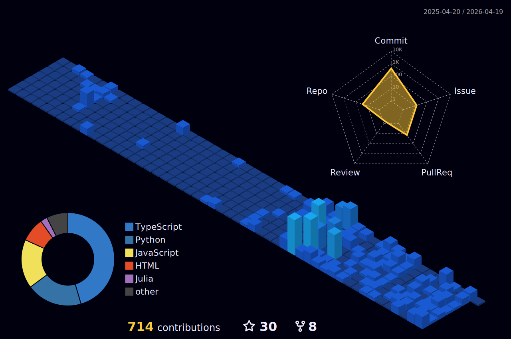

<h2 align="center" > <i> Hello there </i>👋 , I'm Guilherme, but you can call me only gui or medeiros. </h2>

Guia de Navegação: 
 | [Gráficos de Desempenho](#ancora1) |  [Tecnologias e Linguagens](#ancora2) |   [Redes Sociais](#ancora3) |   [OS](#ancora4) |  

          
          <ul>
          <li>💥 I am a Fullstack Developer since early 2022. </li>
          <li>💢 I'm currently learning Java and working with NodeJS. </li>
          <li>💬 If you want to contact me directly, call me on telegram <2 @nokiamed. </li>
          <li>❤️ "Jack of all trades, master of none". </li>
          </ul>
 

          <ul>
          <li>📑 Currently studying Docker , C# | .NET and Machine Learning with python. </li>
          <li>📀Reading Clean Architecture, The Craftsman's Guide to Software Structure and Design. </li>
          <li>💬I have experience with UX/UI Design, see my project prototypes here</li>
          <li>🔉 Contact me here: 
     </li> 
          </ul>  

  

&nbsp;

  
   
  

                    

 
<link rel="stylesheet" href="https://cdn.jsdelivr.net/gh/devicons/devicon@v2.15.1/devicon.min.css">

<h2 align="center"> <i>Tecnologias</i> que possuo domínio </h2>

  

          <h2 align="center" > <i>Sistemas Operacionais</i> que Trabalho/Trabalhei</h2>     
          

                    
                    
                    
                    
                    
          

<h2 align="center" >Confira minhas redes sociais!</h2>

          

                    
                    
                        
                    
                    
                    
                    
          

<h2 align="center" >Confira ferramentas e plataformas que uso!</h2>
          

                    
                    
                    
                    
                    
                    
                    
                    
                             
                    
                    
                    
                    
          

           

<h3 align="center" >Para acessar meu blog no DEVCommunity, clique <a href="https://dev.to/devmedeiros"><i>aqui</i></a>

## Projetos Em Destaque:                 
 &nbsp;
          &nbsp;&nbsp;&nbsp;&nbsp;&nbsp;&nbsp;&nbsp;&nbsp;

